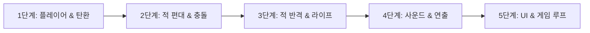

# 🚀 Star Invader (Pygame ➡️ Unity 6) 포팅 완료 보고서

본 문서는 **Python (Pygame)** 기반으로 개발된 2D 클래식 슈팅 게임 **Star Invader**를 **순수 Unity 6 (6000.3.22f1)** C# 컴포넌트 기반 아키텍처로 단계별 포팅한 전체 과정 및 아키텍처 매핑을 정리한 기술 문서입니다.

---

## 1. 개요 및 포팅 목표

* **목표:** 절차적 게임 루프 기반의 Python Pygame 코드를 Unity 6의 **컴포넌트 기반(MonoBehaviour) 및 이벤트 주도(Event-Driven) 아키텍처**로 1:1 완벽 전환
* **개발 방식:** 초기 Pygame 개발 시 밟아왔던 방식과 동일하게 **5단계 마일스톤(Step-by-Step)**을 정의하고, 각 단계별 검증을 거치며 점진적 구축
* **편의성 제공:** 복잡한 Unity 씬 수동 배치를 자동화하는 **Unity Editor 전용 셋업 툴(`StarInvaderSetupTool.cs`)** 제작 및 제공

---

## 2. 엔진 및 아키텍처 비교

| 구분 | 기존 Pygame 아키텍처 | 전환된 Unity 6 아키텍처 |
| :--- | :--- | :--- |
| **실행 구조** | `while running:` 단일 루프 + 델타 타임 | Unity 생명주기 (`Start()`, `Update()`, `FixedUpdate()`) |
| **좌표계 & 단위** | 좌상단 `(0,0)`, `+Y` 아래 방향, 픽셀 단위 | 화면 중심 `(0,0)`, `+Y` 위 방향, 월드 유닛(Unit) 단위 |
| **충돌 판정** | `pygame.Rect.colliderect` 수동 연산 | 2D 트리거 콜라이더 (`BoxCollider2D` + `OnTriggerEnter2D`) |
| **객체 관리** | Python List 순회 및 인스턴스 관리 | 게임오브젝트/컴포넌트 분리 및 Unity 생명주기 관리 |
| **사운드** | `pygame.mixer` 채널 관리 | `AudioSource` + `SoundManager` 싱글톤 |
| **데이터 저장** | 로컬 `ranking.json` 파일 I/O | `Application.persistentDataPath` + `JsonUtility` |

---

## 3. 5단계 마일스톤별 상세 포팅 과정

### [1단계] 플레이어 조작 및 기본 탄환 발사
* **구현 내용:**
  * 카메라 세팅 (Orthographic Size 5, 짙은 우주 배경색)
  * 플레이어 좌우 이동(`A/D` 또는 `←/→`) 및 화면 경계 클램핑 (`Mathf.Clamp`)
  * `Space` 키 사격 및 쿨다운(0.22초), 화면 내 최대 탄환 수(3발) 제한
* **관련 스크립트:** `GameConstants.cs`, `PlayerController.cs`, `Bullet.cs`

---

### [2단계] 적 편대(Alien Fleet) 및 충돌 판정
* **구현 내용:**
  * 3행 × 8열 (총 24기) 적 그리드 자동 스폰 (Top 핑크, Mid 오렌지, Bottom 옐로우)
  * 편대 좌우 동기화 이동 및 벽 충돌 시 하강 패턴
  * 적 격파 시 편대 이동 속도 점진적 가속 기믹 (클래식 인베이더 룰)
  * 플레이어 탄환 ↔ 적 트리거 충돌 시 적 체력 감소/파괴 및 탄환 소멸
* **관련 스크립트:** `Enemy.cs`, `EnemyFleet.cs`, `Bullet.cs (업데이트)`

---

### [3단계] 적 공격 및 플레이어 라이프 시스템
* **구현 내용:**
  * 각 열의 최하단 적 선별(`GetBottomEnemies`) 및 주기적 적 탄환(`EnemyBullet`) 발사
  * 플레이어 시작 목숨 3개 부여, 피격 시 목숨 감소 및 1.2초 무적 깜빡임 연출
  * 적 편대가 플레이어 라인(`INVASION_Y_LIMIT = -3.2f`)에 도달 시 방어선 돌파 패배 판정
* **관련 스크립트:** `PlayerController.cs (업데이트)`, `EnemyFleet.cs (업데이트)`, `Bullet.cs (업데이트)`

---

### [4단계] 사운드 및 이펙트/연출
* **구현 내용:**
  * `SoundManager.cs`: `laser_shoot.wav` 발사음 및 절차적 신스 폭발음 재생
  * `BackgroundScroller.cs`: `bg_space.png` 2장을 활용한 무한 세로 스크롤링
  * `ExplosionEffect.cs`: 적 격파 위치에 폭발 스프라이트 스케일업/페이드아웃 이펙트
  * `CameraShake.cs`: 플레이어 피격 시 화면 흔들림 연출
* **관련 스크립트:** `SoundManager.cs`, `BackgroundScroller.cs`, `ExplosionEffect.cs`, `CameraShake.cs`

---

### [5단계] UI / 전체 게임 루프 / 로컬 랭킹 시스템 (최종 완성)
* **구현 내용:**
  * `GameManager.cs`: `Title` ➡️ `Playing` ➡️ `GameOver` ➡️ `Ranking` 상태 머신 관리
  * `UIManager.cs`: 실시간 HUD (점수, 최고 점수, 목숨 하트), 타이틀 로고, 게임오버 및 신기록 표시, 랭킹 뷰
  * `RankingManager.cs`: JSON 포맷 기반 상위 5개 최고 점수 로컬 영구 저장
* **관련 스크립트:** `GameManager.cs`, `UIManager.cs`, `RankingManager.cs`

---

## 4. 소스 코드 매핑 테이블

| 기존 Pygame 파일 | Unity 6 C# 파일 | 주요 역할 |
| :--- | :--- | :--- |
| `constants.py` | `Assets/Scripts/GameConstants.cs` | 화면 크기, 이동 속도, 쿨다운, 색상 등 상수 정의 |
| `player.py` | `Assets/Scripts/PlayerController.cs` | 플레이어 이동, 사격, 체력/목숨, 무적 코루틴 |
| `bullet.py` | `Assets/Scripts/Bullet.cs` | 플레이어/적 탄환 이동 및 양방향 충돌 판정 |
| `enemy.py` | `Assets/Scripts/Enemy.cs` `Assets/Scripts/EnemyFleet.cs` | 적 개체 피격/점수 처리 및 24기 편대 제어/사격 AI |
| `sound_manager.py` | `Assets/Scripts/SoundManager.cs` | 오디오 재생 관리 (SFX) |
| `ranking_manager.py` | `Assets/Scripts/RankingManager.cs` | 로컬 JSON 최고 점수 저장 및 로드 |
| `main.py` | `Assets/Scripts/GameManager.cs` `Assets/Scripts/UIManager.cs` | 전체 상태 전환, 점수 계산, UI 뷰 렌더링 |
| (신규 연출) | `Assets/Scripts/BackgroundScroller.cs` `Assets/Scripts/CameraShake.cs` `Assets/Scripts/ExplosionEffect.cs` | 우주 배경 스크롤, 카메라 흔들림, 폭발 이펙트 |
| (신규 에디터 툴) | `Assets/Scripts/Editor/StarInvaderSetupTool.cs` | 씬 내 오브젝트 및 프리팹 원클릭 자동 셋업 |

---

## 5. Unity 에디터 실행 및 플레이 가이드

1. **Unity 6 에디터**에서 `StarInvader` 프로젝트를 엽니다.
2. 상단 메뉴 바에서 **`Star Invader` ➡️ `5단계: 전체 게임 루프 및 UI/랭킹 시스템 완성 (최종)`**을 클릭합니다.
   * *카메라, 플레이어, 적 편대, 프리팹, 사운드, 배경, UI 캔버스 및 매니저들이 자동으로 씬에 배치되고 연결됩니다.*
3. 에디터 상단의 **`▶ (Play)`** 버튼을 누릅니다.
4. **조작 키 안내:**
   * **`Space`**: 타이틀 시작 / 탄환 발사 / 게임오버 시 재시작
   * **`A` / `D` 또는 `←` / `→`**: 플레이어 좌우 이동
   * **`R`**: 타이틀 화면에서 랭킹 확인
   * **`ESC`**: 랭킹 및 게임오버 화면에서 타이틀로 복귀

---

## 6. 향후 추가 확장 추천 사항

* **Universal Render Pipeline (URP) 2D 라이트:** 레이저 탄환 및 엔진 불꽃에 2D Point Light를 부착하여 네온 SF 비주얼 극대화
* **WebGL 빌드:** 웹 브라우저에서 바로 즐길 수 있도록 원클릭 배포
* **모바일 가상 패드(Virtual Joystick):** 모바일 터치 컨트롤 지원
